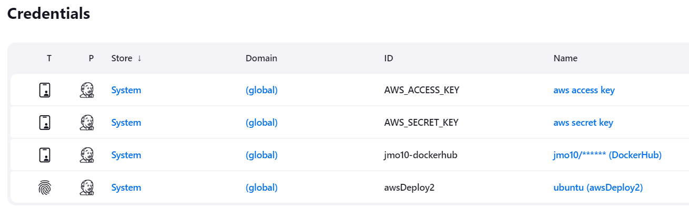
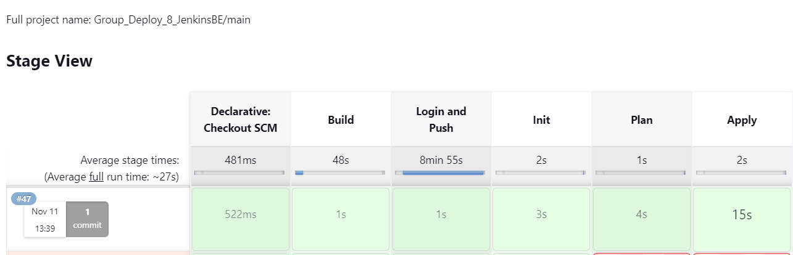
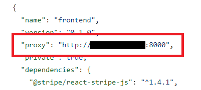
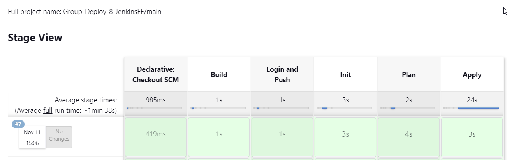
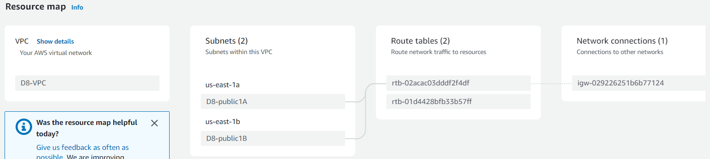
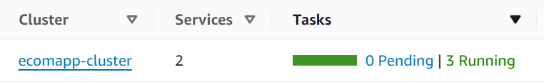
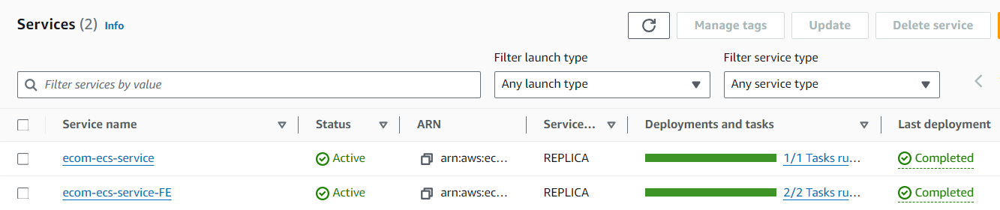
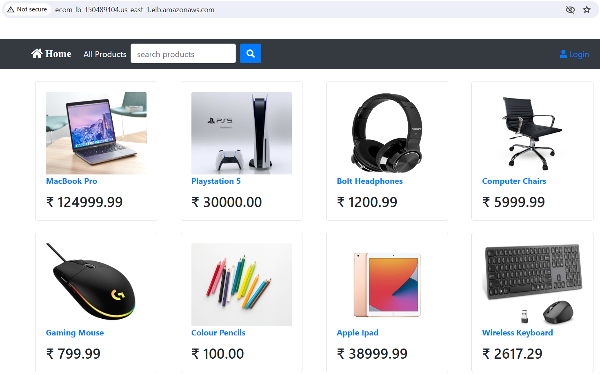

# Title 

November 5, 2023

Contributors:

Annie V Lam - Project Manager

Sameen Khan - Chief Architect

Jorge Molina - System Administrator

# Purpose

Deploy E-Commerce Application in ECS Container.  Some of the tools used to deploy the application are:
```
-Jenkins to automate the CI/CD pipeline
-Terraform was used to automate infrastructure provisioning
-GitHub serves as the repository
-Docker to build the image
-ECS to containerize the application
```

To enhance team collaboration, some of the tools we use are:
```
-Jira to manage the project and tasks
-Google Sheets to share information across the team
```

## Step 1:  Setup for Collaboration

**AWS Setup**

Since we are working in a group, the System administrator had to set up AWS user accounts for my members to collaborate on the same servers. Two user accounts, copying the same permissions as the System administrator. This allows team members to create and access EC2 instances.

**Collaboratorating in GitHub**

Added team members as collaborators to the GitHub

**Jira Board**

A Jira Board was created to list last, assign tasks, and track progress

## Step 2: Diagram the VPC Infrastructure and the CI/CD Pipeline


## Step 3: GitHub/Git

**Setup GitHub Repository for Jenkins Integration:**

GitHub serves as the repository from which Jenkins retrieves files to build, test, and build the infrastructure for the e-commerce application and deploy the e-commerce application.  [GitHub repository](https://github.com/LamAnnieV/group_deployment_8.git)

In order for the EC2 instance, where Jenkins is installed, to access the repository, you need to generate a token from GitHub and then provide it to the EC2 instance.[Generate GitHub Token](https://github.com/LamAnnieV/GitHub/blob/main/Generate_GitHub_Token.md)

With three collaborators on this project, in order to minimize merge conflicts, each collaborator creates a branch and works off of that branch.  The merge to the main repo will be done in GitHub in the [project GitHub repository](https://github.com/LamAnnieV/group_deployment_8.git)

```
git clone https://github.com/LamAnnieV/group_deployment_8.git
cd group_deployment_8
git init
git branch <branch_name>     #each contributor has his/her own branch
git switch <branch_name
#add folders
git add <name_of_folder> #this is done for each folder that is added
#add files
git add <name_of_file>  #this is done for each file that is added
#make edits to files (Terraform files, Docker files, Jenkinfiles, package.json)
git commit -a
git push --set-upstream origin <branch_name>
```

## Step 4: Docker/Dockerfile

### be.Dockerfile:

For this project, we created a Dockerfile for the backend containers in our ECS cluster. Once the Dockerfile was created and configured for our backend image, `docker build` was used to build the image. Following that, `docker image ls` was used to confirm that the image was successfully built. Upon verification, `docker image tag` was used with the old image ID and the new image name, incorporating the DockerHub username. Once the image was correctly named and built, it was pushed to the DockerHub repository using `docker push`. The backend image used the following [configuration in the be.Dockerfile](be.Dockerfile)

### fe.Dockerfile:

For this project, we created a Dockerfile for the frontend containers in our ECS cluster. Similar to the backend setup, after creating and configuring the Dockerfile for our frontend image, `docker build` was used to build the image and `docker image ls` to check its successful creation. After confirming the image build, `docker image tag` was utilized to assign a new name with the DockerHub username included. Subsequently, the image was pushed to the DockerHub repository using `docker push`. The frontend image used the following [configuration in the fe.Dockerfile](fe.Dockerfile).


## Step 5: Terraform

Terraform is a tool that helps you create and manage your infrastructure. It allows you to define the desired state of your infrastructure in a configuration file, and then Terraform takes care of provisioning and managing the resources to match that configuration. This makes it easier to automate and scale your infrastructure and ensures that it remains consistent and predictable.

### Jenkins Agent Infrastructure

Use Terraform to spin up the [Jenkins Agent Infrastructure](d8jenkins/main.tf) to include the installs needed for the [Jenkins instance](d8jenkins/jenkins.sh), the install needed for the [Jenkins Docker agent instance](d8jenkins/docker.sh), and the install needed for the [Jenkins Terraform agent instance](d8jenkins/terraform.sh).

**Use Jenkins Terraform Agent to execute the Terraform scripts to create the E-Commerce Application Infrastructure and Deploy the backend and the front end of the application on ECS with Application Load Balancer**

#### E-Commerce VPC Infrastructure

Create the following [e-commerce application infrastructure](intTerraform/vpc.tf):  

```
1 VPC
2 Availability Zones (AZ)
2 Public Subnets
2 Containers for the frontend
1 Container for the backend
1 Route Table
Security Group Ports: 8000, 3000, 80
1 ALB
```

#### Elastic Container Service (ECS)

Amazon Elastic Container Service (ECS) is a managed container orchestration service.  It is designed to simplify the deployment, management, and scaling of containerized applications using containers. The primary purpose of ECS with Docker images is to make it easier to run and manage containers in a scalable and reliable manner.

AWS Fargate is a technology that you can use with Amazon ECS to run containers without having to manage servers or clusters of Amazon EC2 instances. With Fargate, you no longer have to provision, configure, or scale clusters of virtual machines to run containers.

**Resource Blocks:**

aws_ecs_cluster - A cluster is a group of servers that provides resources hosted on the respective cluster. ECS Cluster is an environment for any container projects that are hosted.

aws_cloudwatch_log_group - creates a CloudWatch Log Group in AWS, which will log and monitor AWS resources and applications

aws_ecs_task_definition - defines the container configuration for the task. It specifies the container name, the Docker image to use, the logging configuration for the container, and the port mapping for the container.  It also defines that the task is running on Fargate. The memory and CPU settings specify the amount of memory and CPU units to be allocated to the task when it is running. The "execution_role_arn" and "task_role_arn" are the IAM roles used for the task's execution and task permissions. They define the AWS roles that provide the necessary permissions to run the task and access other AWS resources.

aws_ecs_service - configures the ECS service with details such as the service name, cluster, task definition, launch type, scheduling strategy, desired count, network configuration, and load balancer configuration.  A major point to note is the scheduling strategy that specifies the scheduling strategy for the service, which, in this case, is set to "REPLICA" to maintain a specified number of instances of the task.  If a load balancer is also associated with the containers, this is where it will be referenced.


#### Application Load Balancer (ALB)

The purpose of an Application Load Balancer (ALB) is to evenly distribute incoming web traffic to multiple servers or instances to ensure that the application remains available, responsive, and efficient. It directs traffic to different servers to prevent overload on any single server. If one server is down, it can redirect traffic to the servers that are still up and running.  This helps improve the performance, availability, and reliability of web applications, making sure users can access them without interruption, even if some servers have issues.

**Resource Blocks:**

aws_lb_target_group - defines the AWS Application Load Balancer target group. It specifies the target group's name, port, protocol, target type, VPC ID, and health check settings. It references the ALB resource. The target groups are being set to the containers

aws_alb" "e_commerce_app - configures an Application Load Balancer (ALB) on AWS. It sets the ALB's name, internal visibility, load balancer type, subnets, and security groups. It depends on the existence of an internet gateway.

aws_alb_listener - defines the configuration for accepting incoming traffic on a specific port and protocol. It is responsible for "forwarding" this traffic to the designated target group. 


**Terraform files to create the resources for backend ECS:   [main.tf](intTerraform/main.tf) and [ALB.tf](intTerraform/ALB.tf)**

**Output Block:**

With the resources created for the backend from [vpc.tf](intTerraform/VPC.tf) and [main.tf](intTerraform/main.tf) the IDs from some of the resources would be required for the Terraform files for the frontend. 
Output blocks can be used.  This output block defines an output variable and provides the information specified. In this case, [outputs](intTerraform/outputs.tf) can be used to output the IDs that can then be passed to the frontend Terraform files. To access the application, an output block with the variable called "alb_url" provides the URL for the ALB created in the script. This URL is created along with the creation of the application load balancer, and this is how the application is accessed.

**Terraform file to create the resources for frontend [ECS](FrontendTF/main.tf)**

As some of the resources have already been created when creating the backend infrastructure, instead of recreating the resources, the IDs and ARN generated from the backend output block can be passed to the resource blocks in the frontend.  

## Step 6: Jenkins

### Jenkins

Jenkins automates the Build, Test, and Deploy the E-Commerce Application.  To use Jenkins in a new EC2, all the proper installs to use Jenkins and to read the programming language that the application is written in need to be installed. In this case, they are Jenkins, Java, and Jenkins' additional plugin "Pipeline Keep Running Step", which is manually installed through the GUI interface.

**Setup Jenkins and Jenkins nodes**

[Create](https://github.com/LamAnnieV/Create_EC2_Instance/blob/main/Create_Key_Pair.md) a Key Pair

Configure Jenkins

Instructions on how to configure the [Jenkin node](https://github.com/LamAnnieV/Jenkins/blob/main/jenkins_node.md)

![images]/(Images/Jenkin_Nodes.png)

Instructions on how to configure [AWS access and secret keys](https://github.com/LamAnnieV/Jenkins/blob/main/AWS_Access_Keys), that the Jenkin node will need to execute Terraform scripts

Instructions on how to configure [Docker credentials](https://github.com/LamAnnieV/Jenkins/blob/main/docker_credentials.md), to push the docker image to Docker Hub



Instructions on how to install the [Pipleline Keep Running Step](https://github.com/LamAnnieV/Jenkins/blob/main/Install_Pipeline_Keep_Running_Step.md)

Instructions on how to install the [Docker Pipeline](https://github.com/LamAnnieV/Jenkins/blob/main/Install_Docker_Pipeline_Plugin.md)


### Jenkins Build for E-Commerce Backend and Frontend Application

This application has two tiers, the frontend is the web layer and the backend are application and database layer.  To connect the frontend to the backend, the backend needs to be created first so that the private IP address of the backend task can be passed to the file package.json:

**Jenkins Build for E-Commerce Application Backend (JenkinsfileBE)**  (Annie)

Jenkins Build:  In Jenkins create a build "Group_Deploy_8_JenkinsBE" to run the file JenkinsfileBE for the E-Commerce application from [GitHub Repository](https://github.com/LamAnnieV/group_deployment_8.git) and run the build.  This build consists of the following stages:

Docker "Build" - this stage builds the backend image from the be.Dockerfile file

"Login and Push" - this stage login Docker Hub with the credentials saved in the Jenkins Global Credentials

Terraform "Init" - this stage passes the AWS Access Key and Secret Key from the Jenkins Global Credentials, goes into the directory where the terraform files for the backend are located, then initializes the working directory

Terraform "Plan" - this stage in addition to the first and second part of the stage above, also, creates an execution plan

Terraform "Apply" - this stage in addition to the first and second part of the stage above, also, executes the actions proposed in a terraform plan



**Pass the IP Address of the backend task to the package.json file** - which allows the frontend to proxy into the backend 



**Jenkins Build for E-Commerce Application Frontend (JenkinsfileFE)**

The stages for the frontend are the same as the backend, the differences are the dockerfile for the frontend creates the image for the frontend, and the terraform files



VPC Resource Map



Cluster



Services



Tasks


**Results:**

The application was launched with the DNS:



## Issue(s)/Debugging/Resolution

1.  Running out of resources in our Jenkins agent hosting Dockers - had to increase the volume
  
2.  The Jenkins build was failing at the "Build" stage - consolidated defining the Docker Hub credentials variable, logging into dockers, and pushing the image to Docker Hub into one stage

    Debugging process: Ran sudo usermod -aG docker and sudo chmod 777 /var/run/docker.sock after installation and was still stuck in the first stage Since the first action item of the Jenkinsfile is to establish environmental variables for Docker, it is highly likely that might be an issue. Switched to using "withCredentials and having the login and the action item in one stage, and tested to see if that would work with Docker. Tested and was able to pass all the stages related to Dockers.
    
3.  The backend task was not successfully provisioning
   
    Debugging process:  manually ran the build and see if it was successful. The issue was the be.Dockerfile was missing a closing bracket
    
4.  When running the Jenkins build for the frontend, it was creating resources that already existed.

   Debugging process:  reviewed the frontend dockerfiles, removed resource blocks that were already created, and used the IDs from the backend output blocks and used in the frontend resource blocks to reference existing resources

5.  Launch Application, but frontend was not connecting to the backend:
     Debugging process:  reviewed the VPC resource map to verify that the subnet the backend is hosted in is routed to the internet gateway, did research on the internet and ChatGPt, and reviewed terraform files.
    Resolution:  Moved the creation of ALB resources to be created with the backend resources and uncommented `depends_on = [aws_internet_gateway.igw]`

## Application Stack

This application is two-tiered.  One tier is for the web layer and the other tier is for the application and data layer

**Frontend**  

Web Layer Stack: React

**Backend serves as an API server**

Application Layer Stack: Python Django

Data Layer Stack: SQLite3

## Area(s) for Optimization

1.  Manual Process:  The IDs from the Terraform backend output were manually entered in the resource blocks in the front end.  Use AWS EKS to eliminate this manual process
2.  Security:  Both the frontend and the backend of the application are hosted in public subnets.  Move the frontend and backend to private subnets and add NAT gateway
3.  Single Point of Failure:  There is only one backend, which consists of both the application and the database.  Increase the backend and put in AWS Relational Database Service (RDS) to sync the data from multiple SQLite3 databases
   

Note:  ChatGPT was used to enhance the quality and clarity of this documentation
  

